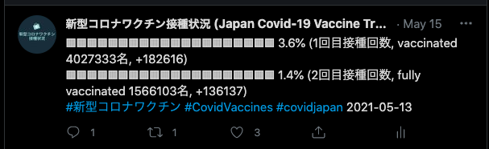

# Japan Covid-19 Vaccine Tracker (新型コロナワクチン接種状況)

A simple Twitter bot to track daily progress for Covid-19 vaccination in Japan.

You can find the tweets in https://twitter.com/JapanVaccine

日本での新型コロナワクチン接種状況を1日一回ツイートします。5％達成するごとに棒グラフの色が更新されます。

ツイッターアカウントは https://twitter.com/JapanVaccine

Data source: https://github.com/owid/covid-19-data/blob/master/public/data/vaccinations/country_data/Japan.csv
